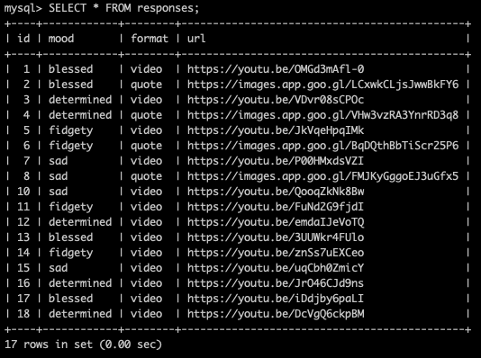
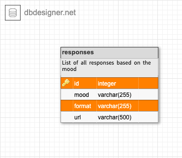

# Step By Step Project (SxS)

## Run Your Development Servers

- Run `yarn start` or `npm start`in project directory to start the Express server on port 5000
- `cd client` and run `yarn start` or `npm start` to start client server in development mode with hot reloading in port 3000.
- Client is configured so all API calls will be proxied to port 5000 for a smoother development experience

## The Step By Step project's full picture

A web application to acknowledge and lift up one's mood in the morning and create, digitally, a wellbeing routine.

## This current piece: Avoid denial and keep the good vibes coming

**Problem Statement:** How to ensure we are in tune with our emotions?

In this repository we are only focusing on one part of this routine project which requires the user to acknowledge her/his feelings to start the day with clarity.
In return the user would get an encouraging response, in the shape of a video or a quote, to launch or sustain the day on a positive foot.

## Dissecting the webapp

This app is composed of 3 components:

1. Parent: Homepage (no use, except from hosting the navigation bar)

2. Two children:

- A user page where the user can perform the routine

- An admin page where the user, who's currently its curator, can easily add more materials (responses) into the database

### All about the user page

- When opening the page the user sees buttons which each match a certain mood.
- The user clicks on the button that most closely expresses her/his emotions.
- When clicked, the response will be displayed at the bottom of the page, in a banner.
- This response contains a URL which will open in another tab, so the user can view the video or quote.
- This link has been randomly selected for her/him and are attached to one of the available moods.
- This random algorithm was designed via MySQL and added to the endpoint.

### All about the admin page

When opening the page, the admin user will see a three input form where she/he will:

- select one of the listed moods: blessed, determined, fidgety, sad
- select one of the media format: video or quote
- paste a url
- click on the submit button

## The data and database logic

The data are held into one **MySql's** table made of four columns.

[Click to view the table](https://dbdesigner.page.link/JG22VNAkk8P3sji67)

When the mood is negative (sad or fidgety) the response should be funny, and dancier.
When the mood is positive (blessed or determined) the response should be inspiring and empowering.

Examples:

- Blessed: https://images.app.goo.gl/LCxwkCLjsJwwBkFY6
- Determined: https://youtu.be/VDvr08sCPOc
- Fidgety: https://images.app.goo.gl/BqDQthBbTiScr25P6
- Sad: https://youtu.be/QooqZkNk8Bw

This logic is very subjective.

### Raw sample data to fill up the MySql's databases

The table contains the 4 below columns:

**Please note the id is autoincremented.**

INSERT INTO responses(mood, format, url) VALUES ("blessed", "video", "https://youtu.be/OMGd3mAfl-0"), ("blessed", "quote", "https://images.app.goo.gl/LCxwkCLjsJwwBkFY6"), ("determined", "video", "https://youtu.be/VDvr08sCPOc"), ("determined", "quote", "https://images.app.goo.gl/VHw3vzRA3YnrRD3q8"), ("fidgety", "video", "https://youtu.be/JkVqeHpqIMk"), ("fidgety", "quote", "https://images.app.goo.gl/BqDQthBbTiScr25P6"), ("sad", "video", "https://youtu.be/P00HMxdsVZI"), ("sad", "quote", "https://images.app.goo.gl/FMJKyGggoEJ3uGfx5");

## The endpoints

This app has 3 endpoints: [Click here to view them](https://docs.google.com/document/d/1wo-DVjdUGO27k_hu2SojB9TLCtARF2CDHrIEaam0neA/edit?usp=sharing)

## Styling

This project was styled using css stylesheet.

The stylesheet is organised into three sections:

- Global styling, shared by several components
- User view styling
- Admin view styling

Each page is composed of four parts, from top to bottom:

- Header
- Main body
- Bottom display (appearing only when needed)
- Navbar

Color codes:

- green: #00cc99
- purple: #78244c
- pink background: #edc7b7
- text-shadow: 0.5px 0.5px rgb(179, 174, 174);

Please head to the stylesheet to find more about the button border colours and the gradients available on the user page.

## Suggested enhancements

\*. Allowing the user'social circle to update the app's database.

_Related user story:_
As a user and admin of this app, it can feel lonely to be using it on my own. Besides, as social links are key to someone's wellbeing, I want my family and friends to co-curate this app at any time of the day while being on the go.

- From opening up the admin form to new users...
- ...to implementing a full on authentication feature
- Improving the database to make it algorithm wise more flexible and to work out several logics...
- ... No concrete idea of what could that be

\*. Ideally the user would know from whom this link comes from

_Related user story:_
As a user, I see this wellbeing app as a wellbeing social link tool and would like to connect the links I receive to the person who sent them to me. Therefore I want to know whom sent me a specific link and thank them accordingly.

\*. Embed the content so the user can stay on the app

\*. Go beyond the emotional wellbeing and make it be an overall bonding tool between people (e.g. lovers, distant friends or relatives, acquaintances)

## Fair warnings

By taking this app, know:

- it's a 2 components app
- a homepage component was not finished
- small front end and small backend
- The styling does not seem scalable (css stylesheet based)
- there is one simple table which has potential to scale to introduce more logic
